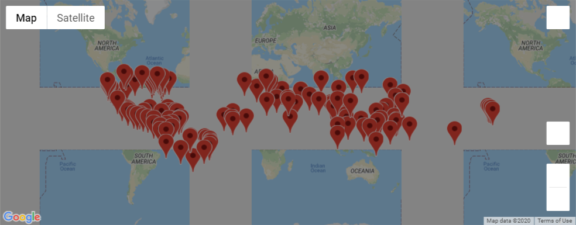

# World_Weather_Analysis
Today we created a query based on a set of randomly generated floats which we treated as latitude and longitude measures. We then used Open Weather Maps to find weather data and, filtering by temperature, we used Google's API to find local hotels and get driving directions between a series of these locations.

We even made fancy pop-up marker maps like the one below!

